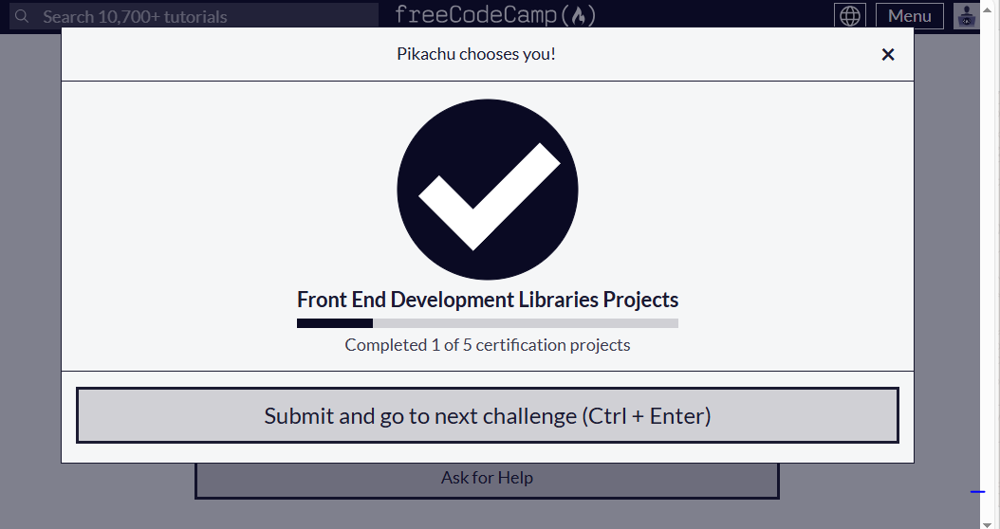

# Random Quote Machine 🚀

## Project Description 📝
The Random Quote Machine is a web application that generates random motivational quotes at the click of a button. This simple and elegant app fetches quotes from an API and allows users to share their favorite quotes on social media platforms like Twitter and Tumblr. Designed with a clean and responsive interface, the Random Quote Machine provides users with a delightful experience across all devices.

## Demo 📸

 
 [Live-link](https://admirable-gumdrop-814cf9.netlify.app/)

## Technologies Used 🛠️

- HTML
- CSS
- JAVASCRIPT
- REACT.JS

## Installation 💻

Installation and Setup Instructions:
Clone the Repository:
git@github.com:iamfarhatsharefi/random-quote-machine.git
Navigate to the Project Directory:
cd Random Quote Machine;

## Usage 🎯

Step 1: Find and Access the Repository
Navigate to the Repository:
Open your web browser and go to GitHub.
Use the search bar to find the repository you want to use, or navigate directly to the repository's URL.
Step 2: Clone the Repository 
Copy the Repository URL:git@github.com:iamfarhatsharefi/random-quote-machine.git

On the repository's main page, click the green "Code" button.
Copy the URL 
Clone the Repository to Your Local Machine:

Open your terminal or command prompt.
Navigate to the directory where you want to clone the repository.
Replace repository with the name of the cloned repository

## Features ⭐

Random Quote Generation: Get inspired with a new random quote every time you click the "New Quote" button.

Responsive Design: The app is fully responsive and works seamlessly across different screen sizes, from mobile phones to desktops.

Social Media Integration: Share your favorite quotes directly to Twitter and Tumblr with pre-formatted messages and hashtags.

Beautiful UI: The application features a unique and visually appealing design with custom colors, fonts, and transitions, providing an engaging user experience.

Easy Navigation: A straightforward and intuitive interface makes it easy for users to navigate the app and interact with its features.

## Author 👩‍💻

[Linkedin](https://www.linkedin.com/in/farhat-sharefi-13a101309?utm_source=share&utm_campaign=share_via&utm_content=profile&utm_medium=android_app)
- [Email](sharefifarhat@gmail.com)

